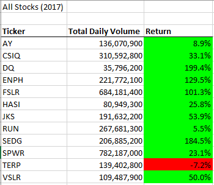
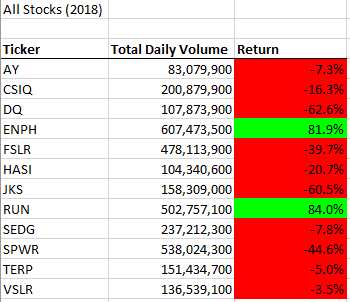
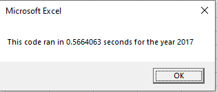
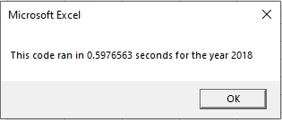
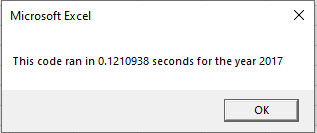
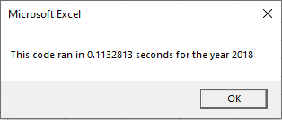

# Stock-analysis

## Overview of Project
The project is to analyze on a number of different stocks in year 2017 and 2018. Two scripts are created in VBA to output some intuitive information about the stocks. 

## Results

### Analysis of Data
Below is the analysis our macro creates. There are twelve tickers. The 'Total Daily Volume' is a sum of volumes in each year. To get the 'Return' value, the ticker's ending price is divided by the ticker's starting price of the year, then substracted by 1. The colomn is color-coded, green means the ticker had a growth in the given year, and red indicates there was a loss. 

We can tell easily from the color that in 2017, the majority hade a positive growth, only one ticker ('TERP') had a negative return. Whereas in 2018, only two tickers ('ENPH' and 'RUN') were growing, all the other tickers were having a negative return. 

### Execution Time of Scripts
Two different scripts are used to perform the analysis, the original one and the refactored one. The original script loop over the rows 12 times, each time it is looking for data for one ticker. The execution time is as below.

But in the refactored script, since the data is ordered by tickers, we only loop over the rows once, which saves a lot of time, shown below.

## Summary

### Advantages and Disadvantages of Refactoring Code
Refactoring code can improve the performance significantly. However, this may be time consuming. It may also land one in a situation where you don't know where to go.

### Pros and Cons to Refactoring the Original VBA Script
The refactored script decreases the execution time by removing the unnecessary nested loop. Although the refactored script may not work if the data is not ordered by tickers.
